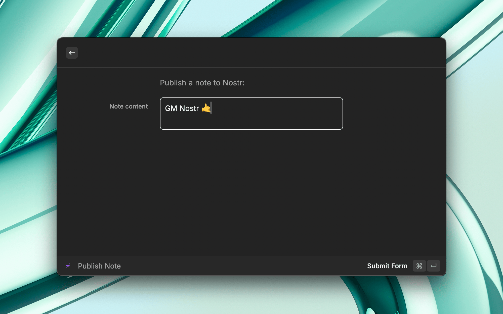

# Nostr

A Raycast extension that lets users publish notes to [Nostr](https://github.com/nostr-protocol/nostr).




## Features
- Publish notes to the Nostr relay network via form submission.
- ~~View trending nostr notes~~ (coming soon)


## Setup
1. Add your private key (in hex format) to the extension preferences.
2. Specify the relays you want to publish to (optional).

## Getting Started
Open the command in Raycast, type your note, and hit Submit!

## Development


### 1. Install Dependencies

```bash
npm install
```

### 2. Start the extension in dev mode

```bash
npm run dev
```

The extension should now be available in Raycast